# Work-by-Roles 项目架构文档

> 本文档用于向 ChatGPT 等 AI 工具提供项目架构分析，包含完整的系统设计、组件关系和数据流。
> 
> **📊 图表说明**: 本文档包含多个 Mermaid 图表，GitHub 会自动渲染这些图表。如果图表无法显示，请确保在支持 Mermaid 的环境中查看（如 GitHub、GitLab、VS Code with Markdown Preview Enhanced 等）。
> 
> **注意**: 本文档包含多个 Mermaid 图表，GitHub 会自动渲染这些图表。如果图表无法显示，请确保在支持 Mermaid 的环境中查看（如 GitHub、GitLab、VS Code with Markdown Preview Enhanced 等）。

## 1. 项目概述

**Work-by-Roles** 是一个多角色技能工作流框架，通过角色边界和工作流阶段来规范开发流程。项目支持两种执行模式：

- **Workflow 模式**：多阶段流程，适用于需要结构化流程的大型项目
- **Role Executor 模式**：简化模式，直接调用角色处理需求，适用于 IDE 环境（如 Cursor）

### 1.1 核心特性

- ✅ 角色（Role）驱动的任务分配
- ✅ 技能（Skill）库管理，支持 Anthropic 标准格式
- ✅ 工作流（Workflow）阶段管理
- ✅ 质量门控（Quality Gates）系统
- ✅ Agent 编排和执行
- ✅ 团队（Team）配置管理
- ✅ 项目上下文扫描和感知

### 1.2 技术栈

- **语言**: Python 3.8+
- **依赖**: PyYAML, pytest
- **可选依赖**: jsonschema（用于 schema 验证）
- **包管理**: setuptools, pyproject.toml

## 2. 系统架构

### 2.0 系统架构概览

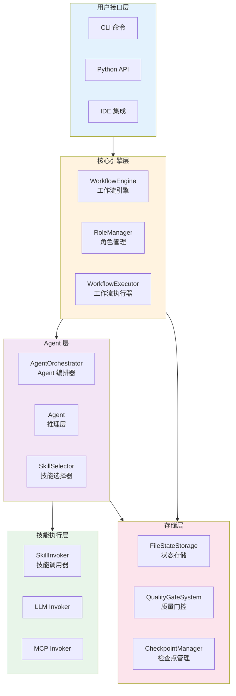

### 2.1 三层架构设计

项目采用严格的三层架构，确保 Reasoning Layer 和 Skill Invocation Layer 完全分离：

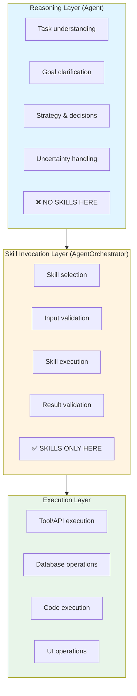

### 2.2 核心组件关系图

#### 组件交互时序图

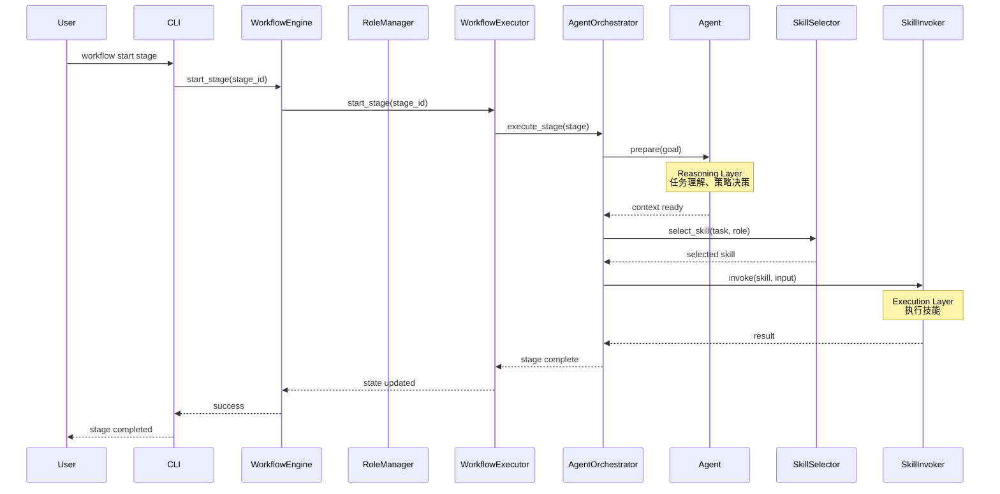

### 2.3 核心组件关系图

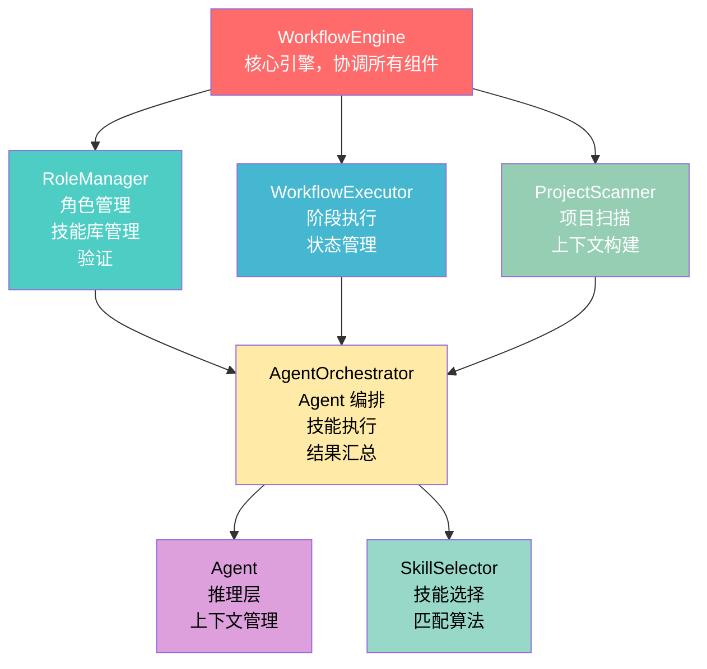

## 3. 核心模块详解

### 3.1 核心引擎 (`work_by_roles/core/engine.py`)

**WorkflowEngine** 是整个系统的核心协调器，负责：

- 工作流初始化和管理
- 组件生命周期管理
- 状态持久化
- 错误处理和恢复

**关键类**:
- `WorkflowEngine`: 主引擎类
- `Agent`: 角色代理，处理推理层
- `AgentOrchestrator`: Agent 编排器，管理技能调用层
- `RoleExecutor`: 角色执行器（简化模式）
- `SkillWorkflowExecutor`: 技能工作流执行器
- `SkillInvoker`: 技能调用器系列（PlaceholderSkillInvoker, LLMSkillInvoker, CompositeSkillInvoker）

### 3.2 数据模型 (`work_by_roles/core/models.py`)

所有数据模型集中在此模块，遵循单一职责原则：

**技能相关模型**:
- `Skill`: 技能定义
- `SkillExecution`: 技能执行记录
- `SkillRequirement`: 角色技能要求
- `SkillBundle`: 技能包

**工作流相关模型**:
- `SkillStep`: 技能工作流步骤
- `SkillWorkflow`: 技能工作流定义
- `SkillWorkflowConfig`: 工作流配置
- `ConditionalBranch`: 条件分支
- `LoopConfig`: 循环配置

**角色和工作流模型**:
- `Role`: 角色定义
- `Stage`: 工作流阶段
- `Workflow`: 工作流定义
- `QualityGate`: 质量门控

**上下文模型**:
- `ProjectContext`: 项目上下文
- `AgentContext`: Agent 上下文
- `ExecutionState`: 执行状态
- `ContextSummary`: 上下文摘要

### 3.3 角色管理 (`work_by_roles/core/role_manager.py`)

**RoleManager** 负责：

- 加载和验证角色定义（从 YAML）
- 管理技能库（支持标准格式和 Anthropic 格式）
- 验证角色技能要求
- 管理技能包和工作流
- 支持角色继承和层次结构

**关键方法**:
- `load_roles()`: 加载角色定义
- `load_skill_library()`: 加载技能库
- `validate_role_skills()`: 验证角色技能
- `get_role()`: 获取角色定义

### 3.4 工作流执行器 (`work_by_roles/core/workflow_executor.py`)

**WorkflowExecutor** 负责：

- 验证工作流结构
- 管理阶段状态转换
- 检查前置条件
- 跟踪完成状态

**关键方法**:
- `start_stage()`: 开始阶段
- `complete_stage()`: 完成阶段
- `can_transition_to()`: 检查是否可以转换到指定阶段
- `get_current_stage()`: 获取当前阶段

### 3.5 技能选择器 (`work_by_roles/core/skill_selector.py`)

**SkillSelector** 负责智能选择最合适的技能：

- 基于任务描述匹配技能
- 考虑角色约束
- 使用历史执行记录评分
- 检查前置条件

**关键方法**:
- `select_skill()`: 选择单个技能
- `select_skills()`: 选择多个候选技能
- `_match_skills_by_task()`: 基于任务匹配技能
- `_score_skills()`: 基于历史记录评分

**技能选择流程**:

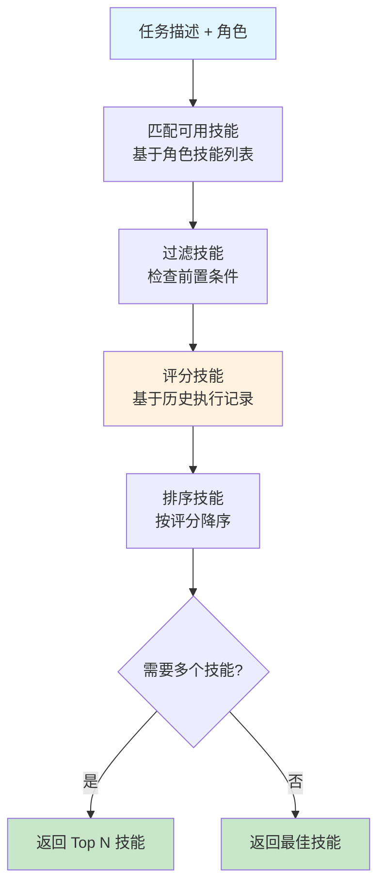

### 3.6 项目扫描器 (`work_by_roles/core/project_scanner.py`)

**ProjectScanner** 负责扫描项目结构并构建上下文：

- 识别项目路径（src, tests, docs, config）
- 扫描规范文件（OpenAPI, Swagger, spec 文件）
- 检测代码标准和工具
- 构建项目上下文

### 3.7 技能调用器系统 (`work_by_roles/core/skill_invoker.py`)

**SkillInvoker** 是技能执行的抽象接口，支持多种执行后端：

**实现类**:
- `PlaceholderSkillInvoker`: 占位符实现，返回模拟结果（用于测试）
- `LLMSkillInvoker`: 基于 LLM 的技能执行器，通过生成提示词执行技能
- `CompositeSkillInvoker`: 组合多个调用器，根据技能类型选择合适执行器
- `MCPSkillInvoker`: MCP 协议调用器，支持调用外部 MCP 服务器

**关键方法**:
- `invoke()`: 执行技能并返回结果
- `supports_skill()`: 检查是否支持特定技能

**执行流程**:
```
SkillInvoker.invoke(skill, input_data)
  → 验证输入数据（根据 skill.input_schema）
  → 执行技能（根据实现类型）
  → 验证输出数据（根据 skill.output_schema）
  → 返回执行结果
```

### 3.8 MCP 集成 (`work_by_roles/core/mcp_skill_invoker.py`)

**MCPSkillInvoker** 支持通过 Model Context Protocol (MCP) 调用外部服务：

**支持的 MCP 操作**:
- `list_resources`: 列出 MCP 服务器上的可用资源
- `fetch_resource`: 获取指定的资源（需要 `resource_uri`）
- `call_tool`: 调用 MCP 工具（需要 `tool` 名称）

**配置方式**:
技能在 `metadata.mcp` 中配置 MCP 信息：
```yaml
metadata:
  mcp:
    action: fetch_resource
    server: cursor-browser-extension
    resource_uri: "mcp://cursor-browser-extension/page/content"
```

### 3.9 SOP 导入系统 (`work_by_roles/core/sop_importer.py`)

**SOPImporter** 从标准操作流程文档自动生成角色、技能和工作流配置：

**核心功能**:
- **智能提取**: 从 Markdown SOP 文档中提取角色、技能和工作流
- **LLM 增强**: 可选使用 LLM 进行深度分析，提高提取准确性
- **模板匹配**: 智能匹配最适合的团队模板
- **标准格式**: 生成符合 Anthropic 标准的技能文件

**提取流程**:
```
SOP文档 → SOPImporter.deep_analyze()
  → 规则提取或 LLM 分析
  → 提取技能（从职责、流程步骤、技能要求）
  → 组合角色（将相关技能组合成角色）
  → 构建工作流（基于技能和角色创建阶段）
  → 生成配置文件
```

**输出**:
- `role_schema.yaml`: 角色定义
- `workflow_schema.yaml`: 工作流定义
- `skills/`: Anthropic 格式技能目录

### 3.10 其他核心模块

- **`condition_evaluator.py`**: 条件表达式求值器，支持复杂条件判断
- **`variable_resolver.py`**: 变量解析器（支持 `${variable}` 语法）
- **`execution_tracker.py`**: 执行跟踪器，记录技能执行历史
- **`state_storage.py`**: 状态存储接口和文件实现
- **`quality_gates.py`**: 质量门控系统
- **`team_manager.py`**: 团队配置管理
- **`schema_loader.py`**: Schema 加载器
- **`config_loader.py`**: 配置加载器
- **`checkpoint_manager.py`**: 检查点管理器，支持工作流状态恢复
- **`intent_handler.py`**: 意图处理器，统一处理用户输入
- **`intent_router.py`**: 意图路由器，将用户意图路由到相应处理流程
- **`intent_agent.py`**: 意图 Agent，处理用户意图分析
- **`bug_analysis_agent.py`**: Bug 分析 Agent，专门处理错误分析
- **`project_manager.py`**: 项目管理器，处理项目初始化和上下文生成

## 4. 执行模式

### 4.1 Workflow 模式

多阶段流程模式，适用于需要结构化流程的大型项目：

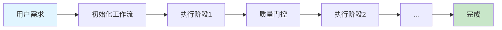

**关键组件**:
- `WorkflowEngine`: 管理整个工作流
- `WorkflowExecutor`: 执行阶段
- `AgentOrchestrator`: 编排 Agent 执行任务

### 4.2 Role Executor 模式

简化模式，直接调用角色处理需求，适用于 IDE 环境：

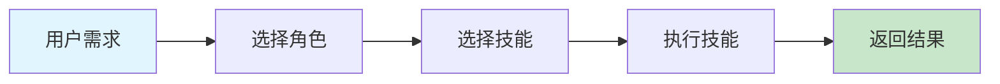

**关键组件**:
- `RoleExecutor`: 简化的角色执行器
- `Agent`: 处理推理
- `SkillSelector`: 选择技能

## 5. 数据流

### 5.1 Workflow 模式数据流

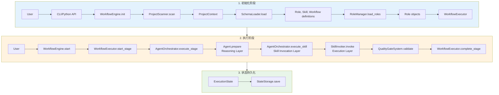

### 5.2 Role Executor 模式数据流

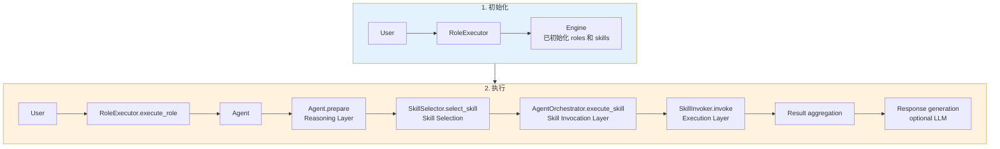

## 6. 配置系统

### 6.1 配置文件结构

项目使用 YAML 配置文件：

```
.workflow/
├── role_schema.yaml      # 角色定义
├── skill_library.yaml    # 技能库定义
└── workflow_schema.yaml  # 工作流定义
```

### 6.2 团队配置

支持多团队配置，位于 `teams/` 目录：

```
teams/
├── standard-delivery/    # 标准交付团队
│   ├── role_schema.yaml
│   ├── skill_library.yaml
│   ├── workflow_schema.yaml
│   └── skills/          # Anthropic 格式技能
│       ├── requirements_analysis/
│       │   └── Skill.md
│       └── ...
└── vibe-coding/          # 其他团队配置
    └── ...
```

### 6.3 技能格式

支持两种技能格式：

1. **标准格式**（skill_library.yaml）:
```yaml
skills:
  - id: skill_id
    name: Skill Name
    description: Description
    dimensions: [dim1, dim2]
    levels:
      1: Level 1 description
    tools: [tool1, tool2]
    constraints: [constraint1]
    input_schema: {...}
    output_schema: {...}
```

2. **Anthropic 格式**（Skill.md）:
```markdown
---
name: skill_name
description: Description
input_schema:
  type: object
  properties: {...}
---

# Skill Content
...
```

## 7. CLI 接口

### 7.1 主要命令

- `workflow init`: 初始化工作流
- `workflow setup`: 一键接入项目
- `workflow wfauto`: 自动执行全部阶段
- `workflow status`: 查看状态
- `workflow role-execute <role> "<requirement>"`: 执行角色（简化模式）
- `workflow list-roles`: 列出所有角色
- `workflow list-skills`: 列出所有技能
- `workflow team list`: 列出所有团队

### 7.2 CLI 实现

CLI 实现在 `work_by_roles/cli.py`，使用 argparse 构建命令行接口。

## 8. Python API

### 8.1 高级 API（推荐）

```python
from work_by_roles import Workflow

workflow = Workflow.quick_start()
workflow.start("requirements")
workflow.complete()
```

### 8.2 底层 API

```python
from work_by_roles.core.engine import WorkflowEngine, RoleExecutor

# Workflow 模式
engine = WorkflowEngine(workspace_path=".")
engine.load_skill_library(Path("skill_library.yaml"))
engine.load_roles(Path("role_schema.yaml"))
engine.load_workflow(Path("workflow_schema.yaml"))
engine.start("stage_id")

# Role Executor 模式
executor = RoleExecutor(engine)
result = executor.execute_role("role_id", "requirement")
```

## 9. 错误处理

### 9.1 异常层次

```
Exception
├── WorkflowError          # 工作流相关错误
├── ValidationError        # 验证错误
└── SecurityError          # 安全错误
```

### 9.2 错误类型

- `SkillErrorType.VALIDATION_ERROR`: 输入验证失败
- `SkillErrorType.EXECUTION_ERROR`: 执行失败
- `SkillErrorType.TIMEOUT_ERROR`: 超时
- `SkillErrorType.TEST_FAILURE`: 测试失败
- `SkillErrorType.INSUFFICIENT_CONTEXT`: 上下文不足

## 10. 状态管理

### 10.1 执行状态

`ExecutionState` 跟踪：
- 当前阶段
- 当前角色
- 已完成阶段
- 技能执行历史

**阶段状态转换**:

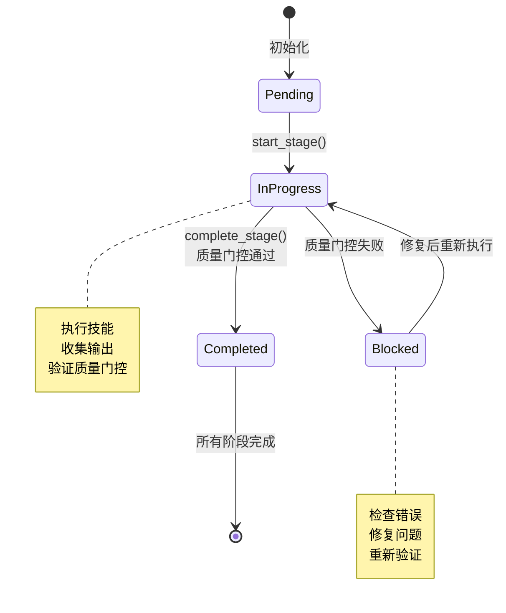

### 10.2 状态持久化

通过 `StateStorage` 接口实现，默认使用 `FileStateStorage`（文件存储）。

状态保存在 `.workflow/state.yaml`。

**状态持久化流程**:

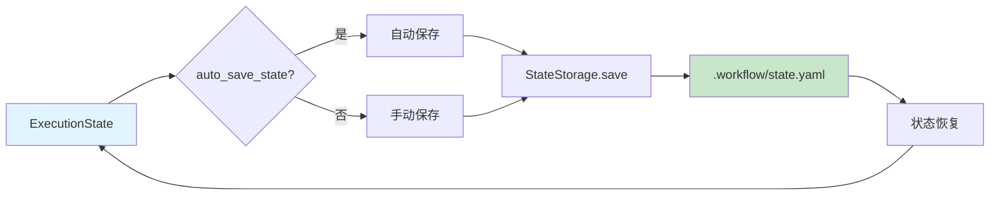

## 11. 质量门控

### 11.1 质量门控系统

`QualityGateSystem` 提供：
- 自定义验证器
- 阶段完成前检查
- 输出验证
- 约束检查

### 11.2 质量门控类型

- 文件存在检查
- 代码质量检查
- 测试覆盖率
- 自定义验证器

## 12. 扩展点

### 12.1 自定义技能

通过创建 `Skill.md` 文件定义新技能，支持：
- 输入/输出 schema
- 工具列表
- 约束条件
- 错误处理

### 12.2 自定义验证器

实现 `QualityGate` 验证器接口，支持自定义质量检查。

### 12.3 自定义技能调用器

实现 `SkillInvoker` 接口，支持自定义技能执行逻辑。

## 13. 测试

### 13.1 测试结构

测试位于 `tests/` 目录：
- `test_e2e_functionality.py`: 端到端功能测试
- `test_skill_system.py`: 技能系统测试
- `test_workflow.py`: 工作流测试
- `test_skill_workflows.py`: 技能工作流测试
- `test_skill_selector_enhanced.py`: 技能选择器测试

### 13.2 测试工具

使用 pytest 作为测试框架。

## 14. 项目结构

```
work-by-roles/
├── work_by_roles/          # 主包
│   ├── __init__.py
│   ├── cli.py              # CLI 接口（主入口）
│   ├── cli/                # CLI 子命令模块
│   │   ├── base.py         # CLI 基础功能
│   │   ├── init.py         # 初始化命令
│   │   ├── setup.py         # 一键接入命令
│   │   ├── workflow.py      # 工作流命令
│   │   └── inspect.py       # 检查命令
│   ├── bootstrap.py        # 引导脚本
│   ├── quick_start.py      # 快速启动 API
│   ├── engine.py           # 向后兼容导出
│   └── core/               # 核心模块
│       ├── __init__.py
│       ├── engine.py       # 向后兼容层（重新导出）
│       ├── workflow_engine.py # 工作流引擎（核心）
│       ├── models.py       # 数据模型（所有数据类）
│       ├── role_manager.py # 角色管理
│       ├── workflow_executor.py # 工作流执行器
│       ├── skill_selector.py    # 技能选择器
│       ├── skill_invoker.py    # 技能调用器接口和实现
│       ├── mcp_skill_invoker.py # MCP 技能调用器
│       ├── project_scanner.py   # 项目扫描器
│       ├── project_manager.py   # 项目管理器
│       ├── condition_evaluator.py # 条件求值器
│       ├── variable_resolver.py   # 变量解析器
│       ├── execution_tracker.py   # 执行跟踪器
│       ├── state_storage.py       # 状态存储
│       ├── quality_gates.py       # 质量门控
│       ├── team_manager.py        # 团队管理
│       ├── team_template_library.py # 团队模板库
│       ├── schema_loader.py        # Schema 加载器
│       ├── config_loader.py        # 配置加载器
│       ├── agent.py                # Agent（推理层）
│       ├── agent_orchestrator.py   # Agent 编排器
│       ├── agent_message_bus.py   # Agent 消息总线
│       ├── role_executor.py        # 角色执行器（简化模式）
│       ├── skill_workflow_executor.py # 技能工作流执行器
│       ├── task_decomposer.py      # 任务分解器
│       ├── task_router.py          # 任务路由器
│       ├── intent_handler.py      # 意图处理器
│       ├── intent_router.py        # 意图路由器
│       ├── intent_agent.py         # 意图 Agent
│       ├── bug_analysis_agent.py   # Bug 分析 Agent
│       ├── sop_importer.py         # SOP 导入器
│       ├── checkpoint_manager.py   # 检查点管理器
│       ├── skill_learning_system.py # 技能学习系统
│       ├── skill_version_manager.py # 技能版本管理
│       ├── skill_composition_engine.py # 技能组合引擎
│       ├── skill_benchmark.py      # 技能基准测试
│       ├── dialog_manager.py      # 对话管理器
│       ├── execution_mode_analyzer.py # 执行模式分析器
│       ├── tool_mapper.py          # 工具映射器
│       ├── llm_client_loader.py    # LLM 客户端加载器
│       ├── llm_stream_handler.py   # LLM 流处理
│       ├── progress_stream.py      # 进度流
│       ├── stream_writer.py        # 流写入器
│       ├── workflow_progress_manager.py # 工作流进度管理
│       ├── immersive_workflow_display.py # 沉浸式工作流显示
│       ├── document_preview_generator.py # 文档预览生成器
│       ├── code_writing_tracker.py # 代码编写跟踪器
│       ├── workflow_events.py      # 工作流事件
│       ├── enums.py                # 枚举类型
│       └── exceptions.py           # 异常定义
│   ├── templates/          # 项目模板
│   │   ├── standard-delivery/  # 标准交付模板
│   │   ├── web-app/            # Web 应用模板
│   │   ├── api-service/         # API 服务模板
│   │   ├── cli-tool/            # CLI 工具模板
│   │   ├── minimalist/         # 极简模板
│   │   ├── security_focused/   # 安全聚焦模板
│   │   ├── standard_agile/     # 标准敏捷模板
│   │   └── team_templates/      # 团队模板库
│   │       ├── agile_scrum.yaml
│   │       ├── devops_pipeline.yaml
│   │       ├── product_discovery.yaml
│   │       └── startup_mvp.yaml
│   └── utils/              # 工具模块
│       └── __init__.py
├── teams/                  # 团队配置
│   ├── README.md
│   └── standard-delivery/  # 标准交付团队
│       ├── README.md
│       ├── role_schema.yaml
│       ├── workflow_schema.yaml
│       └── skills/          # Anthropic 格式技能
│           ├── requirements_analysis/
│           ├── system_design/
│           ├── python_engineering/
│           └── ...
├── skills/                 # 共享技能库
│   ├── requirements_analysis/
│   ├── system_design/
│   ├── python_engineering/
│   └── ...
├── templates/              # 项目模板（已迁移到 work_by_roles/templates）
├── tests/                  # 测试
│   ├── unit/               # 单元测试
│   ├── integration/        # 集成测试
│   ├── e2e/                # 端到端测试
│   ├── cli/                # CLI 测试
│   ├── performance/        # 性能测试
│   └── fixtures/           # 测试夹具
├── docs/                   # 文档
│   ├── ARCHITECTURE.md     # 架构文档（本文档）
│   ├── API.md              # API 文档
│   └── SKILLS_LAYERED_CLASSIFICATION.md # 技能分层分类
├── examples/               # 示例
│   └── ecommerce_order_sop.md # SOP 导入示例
├── .github/                # GitHub 配置
│   ├── CODE_OF_CONDUCT.md
│   ├── ISSUE_TEMPLATE/
│   ├── PULL_REQUEST_TEMPLATE.md
│   └── SECURITY.md
├── pyproject.toml          # 项目配置
├── requirements.txt        # 依赖列表
├── pytest.ini             # pytest 配置
├── README.md              # 项目说明
├── QUICKSTART.md          # 快速开始指南
└── ROLES_AND_SKILLS.md    # 角色与技能关系指南
```

## 15. 关键设计决策

### 15.1 三层架构分离

**决策**: 严格分离 Reasoning Layer、Skill Invocation Layer 和 Execution Layer

**原因**: 
- 确保 Agent 推理阶段不使用技能
- 清晰的职责划分
- 便于测试和维护

### 15.2 数据模型集中管理

**决策**: 所有数据模型集中在 `models.py`

**原因**:
- 单一职责原则
- 便于维护和理解
- 避免循环依赖

### 15.3 支持两种执行模式

**决策**: 同时支持 Workflow 模式和 Role Executor 模式

**原因**:
- 适应不同使用场景
- Workflow 模式适合大型项目
- Role Executor 模式适合 IDE 环境

### 15.4 技能格式支持

**决策**: 支持标准格式和 Anthropic 格式

**原因**:
- 兼容性
- 便于技能共享
- 支持不同工具链

## 16. Agent 协作架构

### 16.1 Agent 消息总线 (AgentMessageBus)

**AgentMessageBus** 提供 agent 之间的消息传递和上下文共享机制：

- **消息类型**: request, response, notification, context_share
- **核心功能**:
  - `publish()`: 发布消息给指定 agent 或广播
  - `subscribe()`: 订阅并获取消息（消息会被移除）
  - `peek_messages()`: 查看消息但不移除
  - `share_context()`: 共享上下文给其他 agent
  - `get_context()`: 获取共享上下文
  - `broadcast()`: 广播消息给所有 agent

- **消息持久化**: 可选的消息持久化到 `.workflow/messages/` 目录

### 16.2 任务分解器 (TaskDecomposer)

**TaskDecomposer** 负责将高级目标分解为子任务：

- **分解模式**:
  - LLM 模式: 使用 LLM 智能分解（如果可用）
  - 规则模式: 基于预定义规则分解（fallback）

- **核心功能**:
  - `decompose()`: 分解目标为任务列表
  - `_analyze_dependencies()`: 分析任务依赖关系
  - `_assign_role()`: 为任务分配合适的角色
  - `_build_execution_order()`: 构建执行顺序（拓扑排序）

- **输出**: `TaskDecomposition` 对象，包含任务列表、执行顺序和依赖关系

### 16.3 并行执行

**AgentOrchestrator** 支持并行执行多个阶段：

- **并行执行方法**:
  - `execute_parallel_stages()`: 异步并行执行（使用 asyncio）
  - `execute_parallel_stages_sync()`: 同步包装器

- **依赖处理**: 自动处理阶段依赖关系，无依赖的阶段可以并行执行

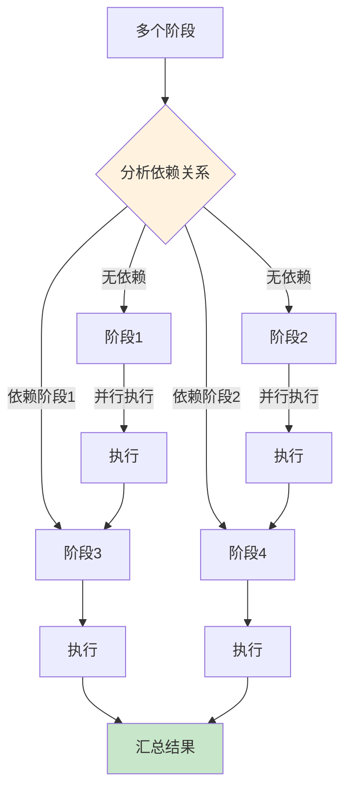

- **协作执行**:
  - `execute_with_collaboration()`: 多 agent 协作执行目标
    - 自动分解目标为任务
    - 创建多个 agent 并分配任务
    - 通过消息总线协调执行
    - 支持 agent 间反馈和 review

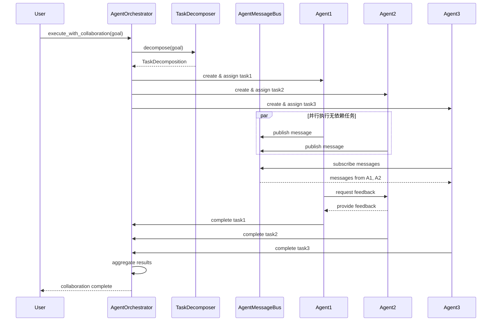

### 16.4 Agent 协作方法

**Agent** 类新增协作方法：

- `review_output()`: Review 其他 agent 的输出
- `request_feedback()`: 向其他 agent 请求反馈
- `send_message()`: 发送消息给其他 agent
- `check_messages()`: 检查新消息（不移除）
- `get_messages()`: 获取并移除新消息
- `share_context()`: 共享上下文给其他 agent

### 16.5 协作流程

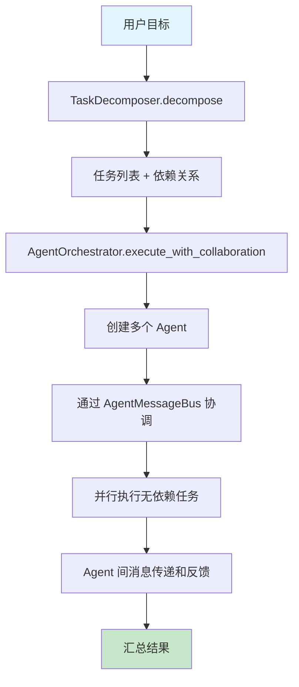

## 17. 技能调用器架构详解

### 17.1 技能调用器层次结构

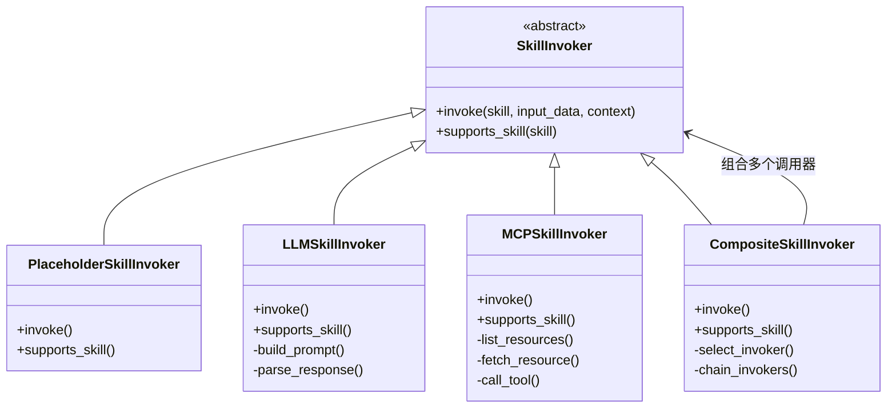

### 17.2 LLM 技能调用器

**LLMSkillInvoker** 使用 LLM 执行技能：

**执行流程**:

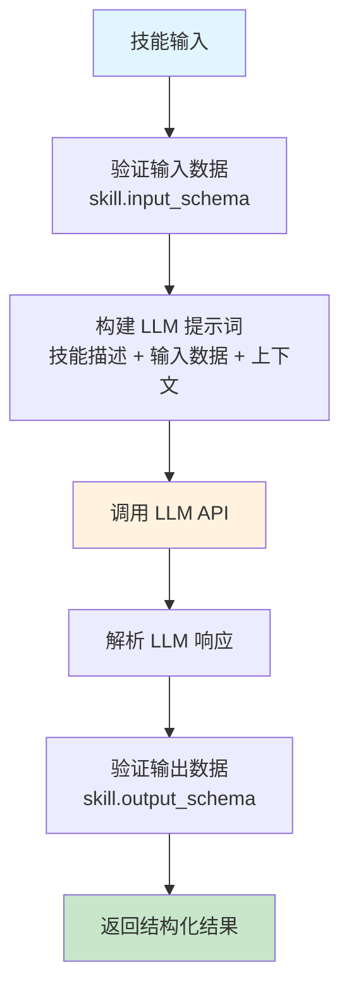

**配置**:
- 支持流式输出（streaming）
- 可配置最大 token 数
- 支持自定义提示词模板

### 17.3 MCP 技能调用器

**MCPSkillInvoker** 通过 MCP 协议调用外部服务：

**支持的 MCP 操作**:
- `list_resources`: 列出可用资源
- `fetch_resource`: 获取资源内容
- `call_tool`: 调用 MCP 工具

**使用场景**:
- 浏览器操作（cursor-browser-extension）
- 文件系统操作
- 数据库查询
- API 调用

### 17.4 组合调用器

**CompositeSkillInvoker** 组合多个调用器：

**选择策略**:

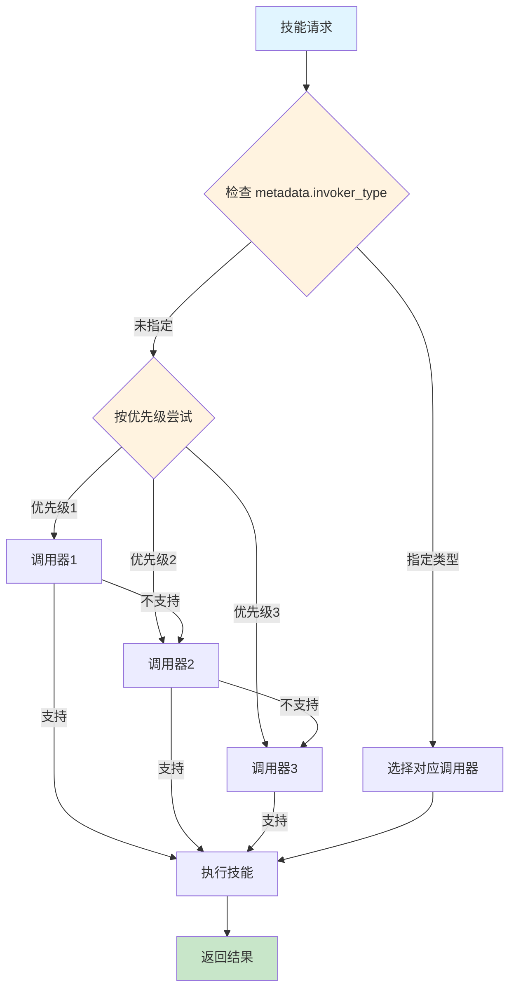

## 18. SOP 导入系统详解

### 18.1 提取流程

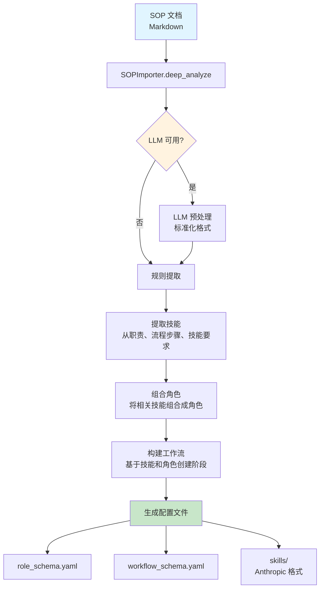

### 18.2 提取策略

**规则提取**:
- 识别 `## Role:` 标题
- 提取角色职责和技能要求
- 识别 `## Process:` 或编号列表
- 构建工作流阶段

**LLM 增强**:
- 使用 LLM 标准化非标准格式
- 深度分析文档结构
- 提取隐含的角色和技能关系
- 提高提取准确性

### 18.3 模板匹配

**TeamTemplateLibrary** 提供模板匹配：

**匹配策略**:
- 关键词匹配（sprint, backlog → 敏捷模板）
- 行业识别（ecommerce, fintech → 相应模板）
- 复杂度评估（简单/中等/复杂）
- 置信度评分

## 19. 设计模式

### 19.1 策略模式

**技能调用器**使用策略模式：
- `SkillInvoker` 接口定义策略
- 不同实现类（LLM、MCP、Placeholder）提供不同策略
- `CompositeSkillInvoker` 组合多个策略

### 19.2 工厂模式

**MCPSkillInvokerFactory** 创建 MCP 调用器：
```python
invoker = MCPSkillInvokerFactory.create(mcp_client=client)
```

### 19.3 观察者模式

**WorkflowEvents** 系统支持事件订阅：
- 阶段开始/完成事件
- 技能执行事件
- 错误事件

### 19.4 责任链模式

**CompositeSkillInvoker** 使用责任链：
- 按优先级尝试不同调用器
- 直到找到支持的调用器

### 19.5 模板方法模式

**Agent.prepare()** 定义算法骨架：
- 子类可重写特定步骤
- 保持整体流程一致

## 20. 未来扩展方向

1. ✅ **并行阶段支持**: 已实现，支持并行执行无依赖阶段
2. ✅ **技能调用器系统**: 已实现，支持多种执行后端
3. ✅ **MCP 集成**: 已实现，支持 MCP 协议调用
4. ✅ **SOP 导入**: 已实现，支持从文档生成配置
5. **可视化界面**: Web UI 或 IDE 插件显示 agent 协作状态
6. **技能市场**: 共享技能库
7. **性能优化**: 大规模项目支持
8. **动态 Agent 管理**: 支持运行时添加/移除 agent
9. **更复杂的协作模式**: Leader-follower、Peer review 等
10. **技能版本管理增强**: 支持技能升级和回滚
11. **技能学习系统增强**: 基于执行历史自动优化技能选择

## 21. 关键代码位置

- **核心引擎**: `work_by_roles/core/workflow_engine.py` (主引擎)
- **向后兼容层**: `work_by_roles/core/engine.py` (重新导出)
- **数据模型**: `work_by_roles/core/models.py` (所有数据类)
- **CLI 接口**: `work_by_roles/cli.py` (主入口)
- **CLI 子命令**: `work_by_roles/cli/` (命令实现)
- **角色管理**: `work_by_roles/core/role_manager.py`
- **工作流执行**: `work_by_roles/core/workflow_executor.py`
- **技能选择**: `work_by_roles/core/skill_selector.py`
- **Agent 编排**: `work_by_roles/core/agent_orchestrator.py`
- **技能调用器**: `work_by_roles/core/skill_invoker.py`
- **MCP 集成**: `work_by_roles/core/mcp_skill_invoker.py`
- **SOP 导入**: `work_by_roles/core/sop_importer.py`

## 22. 依赖关系

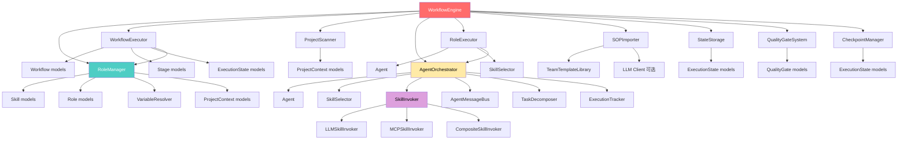

## 23. 性能考虑

### 23.1 技能执行优化

- **技能缓存**: 已执行的技能结果可缓存
- **并行执行**: 支持并行执行无依赖的技能
- **流式处理**: LLM 调用支持流式输出，提升用户体验

### 23.2 状态管理优化

- **增量保存**: 只保存变更的状态
- **压缩存储**: 状态文件使用 YAML 格式，支持压缩
- **检查点机制**: 支持创建检查点，避免重复执行

### 23.3 项目扫描优化

- **增量扫描**: 只扫描变更的文件
- **缓存机制**: 项目上下文可缓存
- **异步扫描**: 支持异步扫描大型项目

## 24. 安全考虑

### 24.1 输入验证

- 所有技能输入都根据 `input_schema` 验证
- 使用 `jsonschema` 进行严格验证
- 防止注入攻击

### 24.2 权限控制

- 角色约束限制可执行的操作
- `allowed_actions` 和 `forbidden_actions` 控制权限
- 质量门控确保输出符合要求

### 24.3 敏感信息处理

- API Key 不存储在代码中
- 支持环境变量配置
- 配置文件可添加到 `.gitignore`

## 25. 总结

Work-by-Roles 是一个设计良好的多角色技能工作流框架，具有：

- ✅ **清晰的架构分层**: 严格的三层架构（Reasoning/Skill Invocation/Execution）
- ✅ **灵活的配置系统**: 支持 YAML 配置、团队模板、SOP 导入
- ✅ **强大的扩展能力**: 可插拔的技能调用器、自定义验证器
- ✅ **完善的错误处理**: 分层的异常体系、详细的错误信息
- ✅ **良好的代码组织**: 遵循 SOLID 原则、单一职责
- ✅ **多执行模式**: 支持 Workflow 模式和 Role Executor 模式
- ✅ **Agent 协作**: 支持多 Agent 协作、消息总线、任务分解
- ✅ **MCP 集成**: 支持通过 MCP 协议调用外部服务
- ✅ **SOP 导入**: 从文档自动生成配置，支持 LLM 增强

**适用场景**:
- 大型项目的结构化开发流程
- IDE 环境中的快速任务执行（Cursor、VS Code）
- 团队协作和角色管理
- 技能驱动的自动化开发
- 从 SOP 文档快速生成工作流配置

**技术亮点**:
- 严格的三层架构分离
- 可扩展的技能调用器系统
- 智能的技能选择算法
- 完善的 Agent 协作机制
- 灵活的配置和模板系统

---

**文档版本**: 2.0  
**最后更新**: 2026
**维护者**: puppy.front@gmail.com


